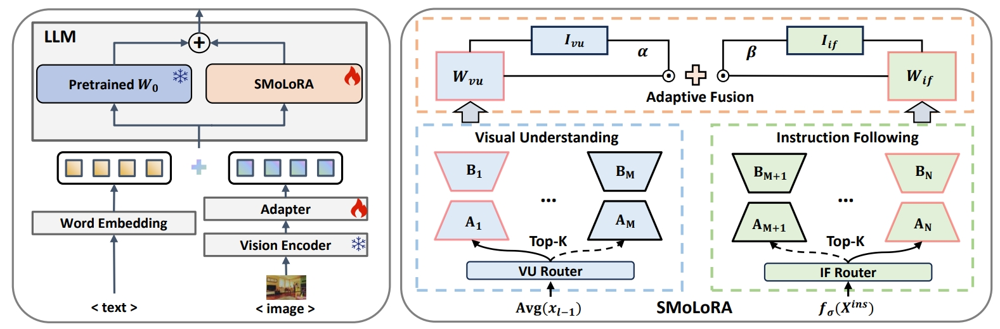

# SMoLoRA: Exploring and Defying Dual Catastrophic Forgetting in Continual Visual Instruction Tuning
This is the official code implementation of "SMoLoRA: Exploring and Defying Dual Catastrophic Forgetting in Continual Visual Instruction Tuning".
 

## Benchmark install
The CVIT benchmark we have constructed encompasses 10 datasets along with their corresponding instruction sets.
### Instruction Tuning Files
You can download instruction tuning files of our CVIT benchmark from [CVIT benchmark](https://huggingface.co/datasets/zackie29/SMoLoRA) 

### Dataset Images
All datasets used in the benchmark are publicly available. You can download the corresponding images directly from each dataset’s official website.

## Training and Evaluation
The training and evaluation code for SMoLoRA will be released soon.

## Acknowledgement
Our project is based on [LLaVA](https://github.com/haotian-liu/LLaVA) and [CoIN](https://github.com/zackschen/CoIN). We sincerely thank them for their outstanding contributions.
